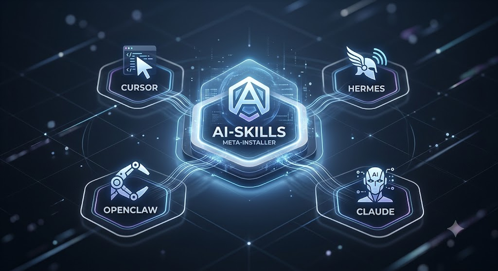

<div align="center">



# 🧰 AI-PRO-SKILLS

**Skills CLI _pro / ops_ pour agents IA — installables sur Cursor · Claude · Hermes · OpenClaw.**

*by Hermes* · dépôt **standalone** · [github.com/Acher1234/AI-PRO-SKILLS](https://github.com/Acher1234/AI-PRO-SKILLS.git)

</div>

> Dépôt **standalone** (pas une copie imbriquée de [AI-Skills](https://github.com/Acher1234/AI-Skills)).

## 🧭 C'est quoi ?

Une collection de _skills_ pro (Coolify, Zscaler, agent-browser, Salesforce, Jira, Google
Workspace, PowerPoint) + un **méta-installeur** (`ai-pro-skills`) qui les enregistre dans
n'importe quel outil.

Même principe qu'AI-Skills : **une librairie partagée + un env Python/npm partagé** sur la
machine. On **ne re-clone pas** et on **ne réinstalle pas** les dépendances à chaque projet.

| | |
|---|---|
| 🎯 **Multi-cibles** | Cursor · Claude · Hermes · OpenClaw *(Claude & OpenClaw en cours)* |
| 🌐 **Skills externes** | Installe **n'importe quel** repo git de skill |
| ♻️ **Env partagé** | Un venv Python (`~/.ai-pro-skills/.venv`) + npm global ; **chaque skill y installe ses propres deps** (une fois, pas par projet) |
| 📦 **Cache partagé** | Repos externes clonés **une fois** dans `~/.ai-pro-skills/ext/` |

## 🏛️ Architecture

```
~/.ai-pro-skills/        librairie partagée ($AI_SKILLS_HOME)
├── install.sh           le méta-installeur (piloté par /ai-pro-skills)
├── common/              helpers partagés (skill_home: lib shared + .env par workspace)
├── ext/<repo>/          skills git externes, clonés UNE FOIS
├── .venv/               venv Python partagé (tous les skills python)
└── <skills>/            coolify, zscaler, reddit, jira, …

npm i -g <pkg>           CLIs node globaux partagés (agent-browser, …)

        │ register = cp ONLY SKILL.md ; secrets (.env) à côté du skill enregistré ↓
~/.cursor/skills/<name>/SKILL.md + .env     (ou ./.cursor/skills/<name>/ pour un projet)
```

**Modèle hybride :** le code CLI est **shared** ; le `.env` / tokens sont **par workspace**
(résolus via `common/skill_home.py`) pour permettre plusieurs comptes (Reddit, Jira, …).

## 🚀 Installation

```bash
# 1. Cloner la librairie partagée (une fois)
git clone https://github.com/Acher1234/AI-PRO-SKILLS.git ~/.ai-pro-skills

# 2. Voir les 3 commandes du helper
cd ~/.ai-pro-skills
./install.sh --help     # fetch, pip init, npm init
```

Puis colle le prompt d'installation dans un chat **Agent**, ou lance `/ai-pro-skills`.
Le flux : **1)** l'outil (Cursor / Claude / Hermes / OpenClaw) → **2)** la portée
(global / projet / profil) → **3)** ce qu'on installe (URL git externe, skill intégré, ou chemin local).

## 🪄 `/ai-pro-skills` — l'installeur

`install.sh` a **3 commandes** : `fetch`, `pip init`, `npm init`. Enregistrer un skill dans un
outil = un simple `cp` du `SKILL.md`.

```bash
cd ~/.ai-pro-skills

# skill intégré → cp du SKILL.md vers l'outil (Cursor global)
mkdir -p ~/.cursor/skills/coolify && cp ~/.ai-pro-skills/coolify/SKILL.md ~/.cursor/skills/coolify/SKILL.md

# skill git externe → cloné une fois, puis cp
SRC=$(./install.sh fetch https://github.com/some/pro-skill.git pro-skill)
mkdir -p ~/.claude/skills/pro-skill && cp "$SRC/SKILL.md" ~/.claude/skills/pro-skill/SKILL.md

# le skill installe SES deps tout seul (1re exécution) dans le venv partagé
./install.sh pip init "$SRC"                    # ou, depuis le dossier du skill : ./install.sh pip init .
```

> L'installeur **ne fait pas** de `pip install` pour toi : `fetch` (clone) + `cp` (register).
> Chaque skill installe **ses propres** dépendances via `pip init` / `npm init`, à son premier run,
> dans le venv partagé (`~/.ai-pro-skills/.venv`) — une fois par machine.

| Cible (`tool` / `scope`) | Dossier d'install |
|--------------------------|-------------------|
| `cursor` / `global` | `~/.cursor/skills/<name>/` |
| `cursor` / `project` | `./.cursor/skills/<name>/` |
| `claude` / `global` | `~/.claude/skills/<name>/` *(WIP)* |
| `claude` / `project` | `./.claude/skills/<name>/` *(WIP)* |
| `hermes` / `all` | `~/.hermes/skills/<name>/` |
| `hermes` / `profile` | `${HERMES_HOME}/skills/<name>/` |
| `openclaw` / `global` | `~/.openclaw/skills/<name>/` *(WIP)* |
| `openclaw` / `project` | `./.openclaw/skills/<name>/` *(WIP)* |

> **Claude** et **OpenClaw** sont **en cours d'implémentation** : les chemins ci-dessus sont les
> valeurs par défaut de [`install.sh`](install.sh) (fonction `target()`) et pourront être ajustés
> quand les conventions de ces outils seront figées.

## 📋 Skills

| Skill | Description | Notes |
|-------|-------------|-------|
| `coolify` | Coolify : status / deploy / restart | python |
| `zscaler` | Zscaler ZPA / ZIA / ZIdentity | python |
| `agent-browser` | Automation navigateur pour agents IA | stub + `npm i -g agent-browser` ([upstream](https://github.com/vercel-labs/agent-browser)) |
| `sf` | Installe / met à jour les skills Salesforce | sync [forcedotcom/sf-skills](https://github.com/forcedotcom/sf-skills.git) → `~/.ai-skills/sf-skills` |
| `jira` | Installe **tous** les skills JIRA Assistant + CLI `jira-as` | `/jira` |
| `google-workspace` | Gmail, Calendar, Drive, Docs, Sheets (OAuth + CLI) | vendored ([hermes-agent](https://github.com/NousResearch/hermes-agent/tree/main/skills/productivity/google-workspace)) |
| `powerpoint` | Créer / éditer des présentations `.pptx` | vendored ([hermes-agent](https://github.com/NousResearch/hermes-agent/tree/main/skills/productivity/powerpoint)) |

## 📂 Working directories

| Skill | Working directory |
|-------|-------------------|
| `coolify` | `~/.ai-pro-skills/coolify` |
| `zscaler` | `~/.ai-pro-skills/zscaler` |
| `agent-browser` | CLI global après `npm i -g agent-browser` ; stub dans `~/.ai-pro-skills/agent-browser` |
| `sf` | meta-skill dans `~/.ai-pro-skills/SF` ; cache SF : `~/.ai-skills/sf-skills/skills/{skills_dir}` |
| `jira` | cache : `~/.ai-pro-skills/jira/JIRA-Assistant-Skills` ; CLI `jira-as` |
| `google-workspace` | `~/.ai-pro-skills/google-workspace` (scripts sous `scripts/`) |
| `powerpoint` | `~/.ai-pro-skills/powerpoint` |

Les skills Python doivent cibler l'interpréteur **partagé** `~/.ai-pro-skills/.venv/bin/python`.

## 🧩 Créer un nouveau skill

Voir **[`SKILL_TEMPLATE.md`](SKILL_TEMPLATE.md)** (structure, `SKILL.md`, slash `/{skill}_{command}`, sécurité).

## 🚀 Usage

Invoque via :
- Cursor / Claude / OpenClaw Agent : `/coolify`, `/zscaler`, `/agent-browser`, `/sf`, `/jira`, `/google-workspace`, `/powerpoint`
- CLI directe sous `~/.ai-pro-skills/<skill>/`
- Hermes cron / shell

Pour **agent-browser**, après install : `npm i -g agent-browser && agent-browser install`, puis
`agent-browser skills get core` (voir [`agent-browser/README.md`](agent-browser/README.md)).

Pour **sf**, lance `/sf` pour sync [forcedotcom/sf-skills](https://github.com/forcedotcom/sf-skills.git) dans `~/.ai-skills/sf-skills`.

Pour **google-workspace**, run une fois `python ~/.ai-pro-skills/google-workspace/scripts/setup.py --check`.
Les fichiers OAuth vivent sous `$HERMES_HOME` — **ne jamais** les committer. Garde les secrets dans le
`.env` de l'outil (`~/.cursor/.env`, `~/.claude/.env`, `$HERMES_HOME/.env`, `~/.openclaw/.env`).

---

*Dépôt pro standalone — s'installe via `/ai-pro-skills` (env partagé, multi-outils).*
